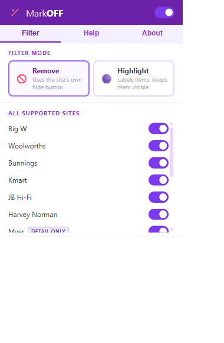
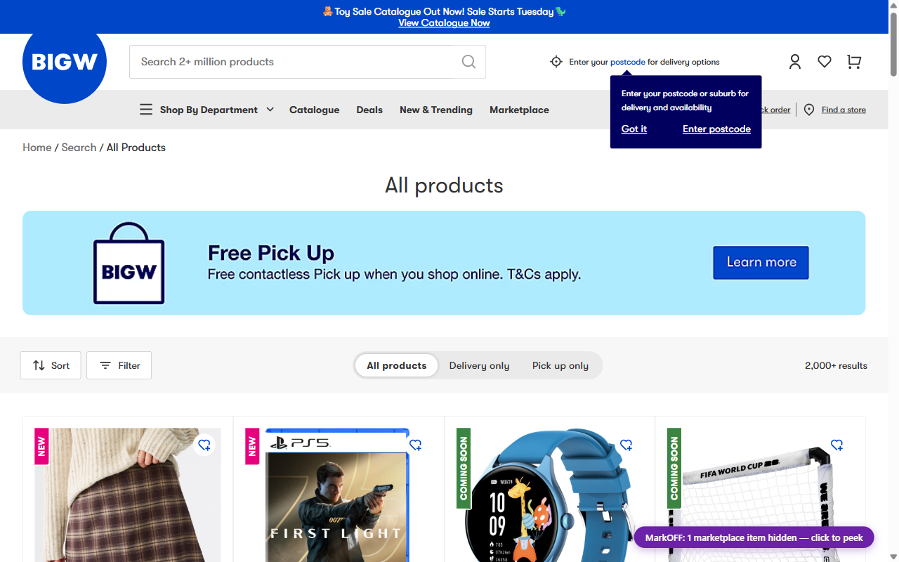

# MarkOFF

* Somewhere along the way, Big W became a marketplace. So did Bunnings. And Woolworths. And Kmart, JB Hi-Fi, Harvey Norman, Myer, Kogan, and THE ICONIC.

* Nobody told you. That's not an accident.

* This is a Chrome/Edge extension that hides or labels third-party marketplace items on Australian retail websites automatically, so you're not sitting there clicking around like an idiot before you hand over your credit card.

* **Remove** mode hides marketplace items outright, or auto-clicks the site's own filter where one exists. **Highlight** mode marks them with a purple outline — still there, clearly flagged.

* Detail page warnings on product pages for marketplace sellers.

* No backend. No account. No data collected. Just less marketplace crap.

---

## Screenshots




---

## Supported Sites

| Site | How it works |
|---|---|
| Big W | Native toggle button + card-level fallback |
| Woolworths (Everyday Market) | Auto-clicks the "Hide Everyday Market" chip |
| Bunnings | `data-locator` badge on product cards |
| Kmart | `kosmos-ds-Box[role=status]` badge |
| JB Hi-Fi | URL param `?excludeMarketplace=true` on collections, card badge on search |
| Harvey Norman (Customer Direct) | `ONLINE ONLY` flag on listing cards, detail page warning |
| Myer (Myer Market) | Detail page warning (listing pages don't expose seller identity) |
| Kogan | Detail page warning with own-seller suppression |
| THE ICONIC | `data-track-affiliation` / `.sponsored-message` on listing cards |

Myer is migrating to a new marketplace platform in 2026. Selectors may need updating after that.

---

## Getting Started

* Clone the repo

* Go to `chrome://extensions`, enable Developer Mode, click **Load unpacked**, point it at the repo folder

* Go to `edge://extensions` if you're on Edge, same deal

* Click the MarkOFF icon in your toolbar. Pick a mode. Done.

* ...profit

---

## How Selectors Are Maintained

Each supported site has an entry in `sites.js` with CSS selectors for its marketplace badge. Retailers like to think their frontend is unique. It's not — it's just patterns. When they update it anyway (and they will), this is the only file that needs updating.

`dev/devtools-probe.js` is a self-contained script you can paste into any retailer's console to help discover new selectors. Run it on a search/browse page that contains marketplace items.

`dev/selector-notes.md` has inspection history and notes per site.

---

## Structure

```
sites.js              single source of truth — all retailer configs
content/filter.js     injected into retailer pages, does the actual work
popup/                extension popup (filter settings, help, about)
background.js         service worker, mostly just handles install defaults
dev/                  devtools probe, icon generator, store listing copy
icons/                icon assets
```

---

## Notes

* Retailers update their shit constantly. If filtering breaks on a site, it's a selector — find the new one with the devtools probe, update `sites.js`, set `inspected: true`, done. That's basically programming.

* The extension reloads itself programmatically during development via `window.postMessage({ type: 'MARKOFF_RELOAD' }, '*')` from any injected page. Saves having to visit `chrome://extensions` every five minutes.

* Harvey Norman uses "ONLINE ONLY" as the listing-page signal for Customer Direct items. Real transparent of them.

* THE ICONIC hides seller identity on listing pages entirely. The `data-track-affiliation` badge targets sponsored/affiliate-injected listings specifically. About 42% of their GMV is third-party, so statistically you're probably fine.

* Woolworths' "Hide Everyday Market" button filters at the server level by adding `isHideEverydayMarketProducts=true` to the URL. This means it also applies to pagination and any sharing of the filtered URL, which is a nice side effect.

---

## Contributing

Open an issue or PR. If a retailer has changed their shit and filtering is broken, the most useful thing is the selector you found with the devtools probe and which page you were on.
